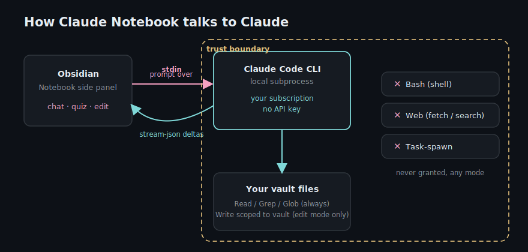
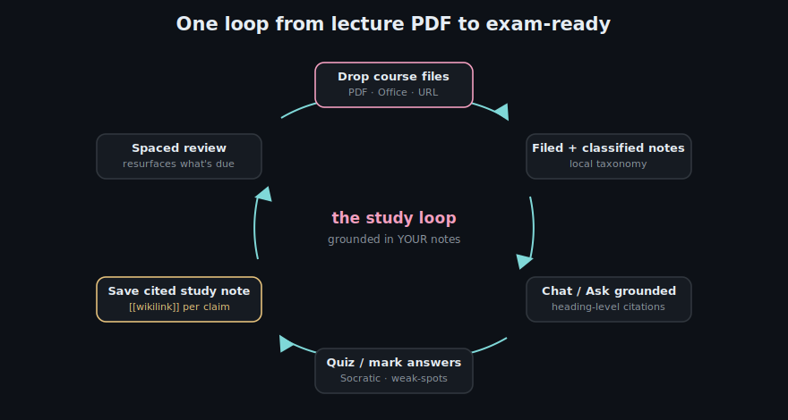
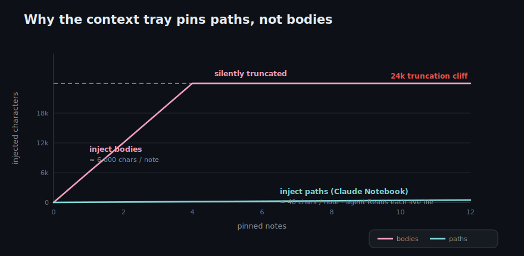
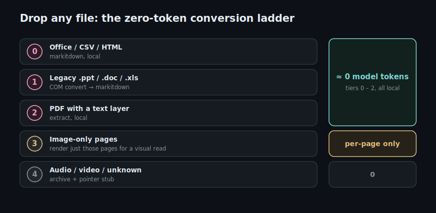
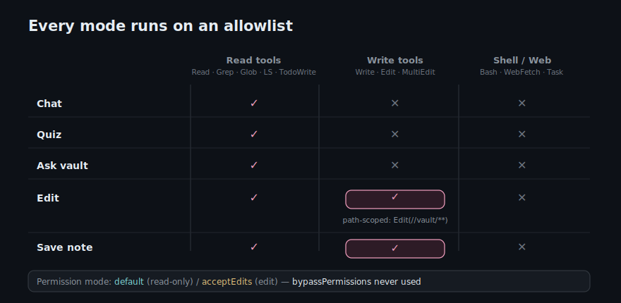

# Claude Notebook

An Obsidian plugin that fuses a Markdown note with a live Claude agent. Open a note, chat with Claude in a side thread, let it edit the note, quiz you on it, or auto-file documents you drop into your vault — all from inside Obsidian.

> **Desktop only.** This plugin runs the Claude command-line tool as a local subprocess, so it needs a desktop OS (Windows/macOS/Linux). It does not run on Obsidian mobile.

## What it does

- **Chat** against the active note — grounded in your own material, with **heading-level citations** you can hover to preview the exact source passage.
- **Ask your whole vault** — a read-only mode that searches every note (agentic grep, no index) and cites what it consulted, plus a "Find in my notes" ranked search.
- **Multi-note context tray** — pin several notes and **"Synthesise across these"** into one explanation with a `[[wikilink]]` per claim. Study a whole subject, not one lecture.
- **Edit mode** — ask Claude to revise the current note; writes are **path-scoped to your vault** and every edit is **one-click undoable** (a multi-level stack).
- **Quiz mode + study presets** — Socratic quizzing, practice questions, flashcards, explain-simply, predict-exam, weak-spots, mark-my-answer.
- **Spaced review** — teach a topic once and the plugin schedules spaced reviews and resurfaces what's due.
- **Drop to file** — drop a PDF/Office document (or a URL) anywhere and the plugin converts it to clean Markdown and files it by a local, zero-network taxonomy (customisable via a routing note).
- **Style-guide note** — point the plugin at a note of your own conventions and it shapes every answer.

## How it works



*The panel talks to a local Claude CLI subprocess over stdin — no API key, and shell, web, and task-spawning tools are never granted.*



*One loop takes a dropped lecture PDF all the way to spaced, exam-ready review — every answer grounded in your own notes.*

## Try it

Two ready-to-open vaults live in this repo:

- **`examples/demo-vault`** — pre-filled with linked course notes, a spaced-review schedule, and filed documents, so you can see every feature working immediately. Open it, sign the CLI in, and press <kbd>Ctrl/Cmd</kbd>+<kbd>Shift</kbd>+<kbd>K</kbd>.
- **`examples/template-vault`** — a clean, structured starter. Open it, read `Start Here.md`, rename the example subject, and begin your own study.

## Demo

<!-- gifs added on release; see the recording shot-list -->



*The context tray pins file paths, not bodies — so the agent reads each live file instead of hitting the truncation cliff.*



*Drop any file and it climbs the cheapest rung that works — tiers 0 to 2 cost roughly zero model tokens.*

*(gifs coming soon)*

## Requirements

- **[Claude Code CLI](https://docs.claude.com/en/docs/claude-code)** installed and signed in. The plugin invokes it as a subprocess; it uses whatever account that CLI is logged in to.
- **Python** (optional) — only needed for the document-conversion feature (`convert.py`, bundled). Point the plugin's "Python path" and "convert.py path" settings at your install.

## What this plugin sends, runs, and touches — read before installing

This plugin is transparent about every external action it takes:

- **It sends note and chat content to Anthropic.** When you chat, edit, or quiz, the plugin runs the Claude CLI as a subprocess, which sends the relevant note text and your messages to Anthropic's API to generate a response. Don't use it on notes you aren't comfortable sending to Claude.
- **It runs a Python subprocess** (`convert.py`) to convert dropped documents to Markdown, if you enable document conversion and configure a Python path.
- **It fetches URLs you drop in**, over the network, to save them as reader notes.
- **It reads and writes files inside your vault** (to create filed notes and, in edit mode, to modify the note you point it at). An optional, off-by-default setting can move files out of your Downloads folder into the vault — leave it off unless you want that.

## Security model

- The prompt is passed to the CLI over **stdin**, never on the command line, so note or chat content can never be interpreted by a shell.
- Tools are gated by an explicit **allowlist** per mode. Read-only modes (chat, quiz) get only `Read`, `Grep`, `Glob`, `LS`; edit mode adds `Write`, `Edit`, `MultiEdit`. **No mode is ever granted shell (`Bash`), web, or task-spawning tools**, and the CLI's `bypassPermissions` mode is never used.



## Install (manual)

1. Download `main.js`, `manifest.json`, and `styles.css` from the latest release.
2. Copy them into `<your vault>/.obsidian/plugins/claude-notebook/`.
3. Reload Obsidian and enable **Claude Notebook** in Settings → Community plugins.
4. Open the plugin settings and confirm your model choices (and Python paths, if you want document conversion).

## Build from source

```
npm install
npm run build     # type-checks, then produces main.js
```

## License

[MIT](LICENSE) © Avesta Jamali
